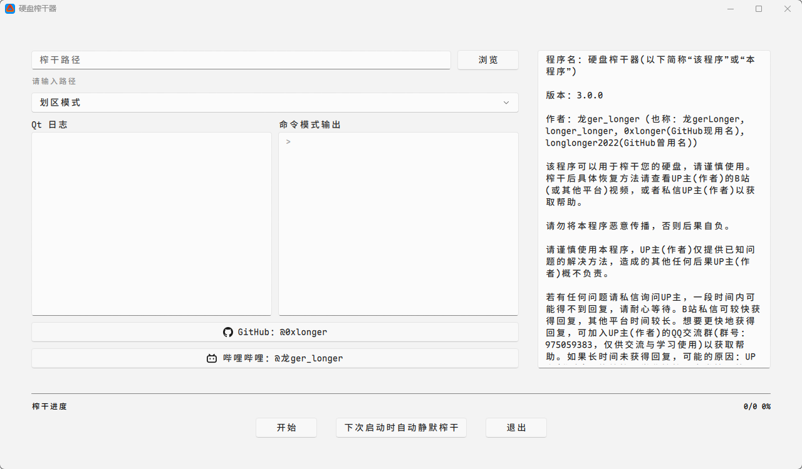
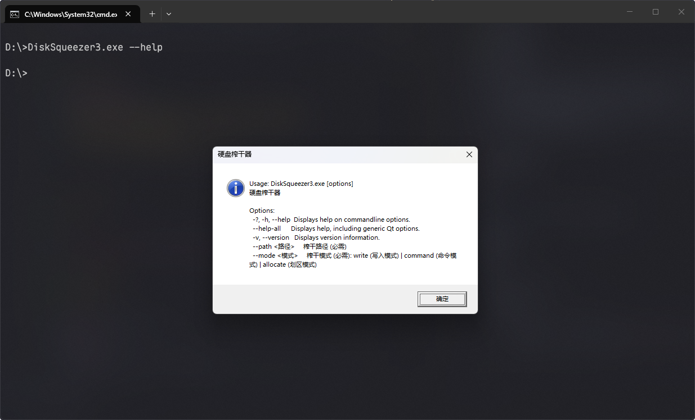
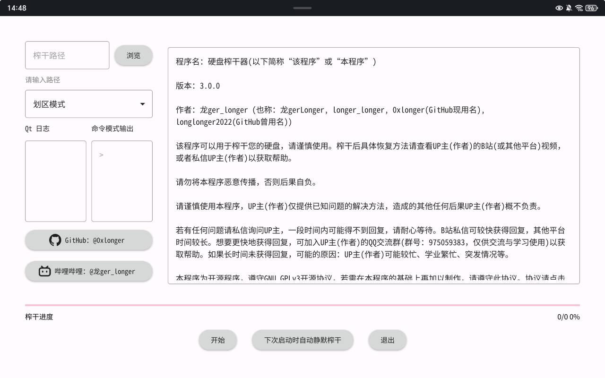

<div align="center">

# 硬盘榨干器 — Disk Squeezer


> **"十分嚎用的磁盘榨干工具👍"**

[](https://github.com/0xlonger/Disk-Squeezer)
[](https://space.bilibili.com/3493110082439389)

</div>

---

## 免责声明

本程序会可以将磁盘剩余空间占满，请谨慎使用。使用即表示您同意自行承担使用本程序可能带来的风险和后果。若出现使用造成的后果，可以向作者寻求帮助，作者仅提供已知问题的解决方案，不承担任何责任。

---

## 功能

- **三种榨干模式**
  - **写入模式** — 速度中等，逐块写入零字节文件，支持 **暂停/继续/取消**
  - **命令模式** — 高速，调用系统原生命令（Windows: `fsutil`, PowerShell；Linux/macOS: `fallocate`, `dd`）
  - **划区模式** — 极速，直接分配磁盘空间（Windows: `SetFilePointerEx`；Linux: `posix_fallocate`；最终回退: `QFile::resize`）
- **图形界面** — 基于 Qt 6 + QML，FluentWinUI3 风格（Android 为 Material 风格）
- **命令行支持** — 可在命令行输入参数静默运行
- **自动静默榨干** — 可设置后下次启动自动榨干
- **跨平台** — Windows、Linux、Android 全覆盖

---

## 界面预览





---

## 快速开始

### 下载

- 前往 [GitHub Releases 页面](https://github.com/0xlonger/Disk-Squeezer/releases) 下载对应系统和架构的预编译版本。
- 前往 龙ger_longer 的个人网站 [GitHub Pages](https://0xlonger.github.io/products/Disk-Squeezer/download/) 或 [Cloudrflare Pages](https://lgr.pages.dev/products/Disk-Squeezer/download/) 下载对应系统和架构的预编译版本。

### 从源码构建

#### 前置依赖

- **Qt 6.8+**（推荐 6.10.1）
- **CMake 3.16+**
- 平台相关：
  - **Windows**：MSVC 或 MinGW
  - **Linux**：g++ / clang，需安装 `libgl1-mesa-dev`
  - **Android**：Android SDK + NDK

#### 构建步骤

```bash
git clone https://github.com/0xlonger/Disk-Squeezer.git
cd Disk-Squeezer
cmake -B build
cmake --build build
```
